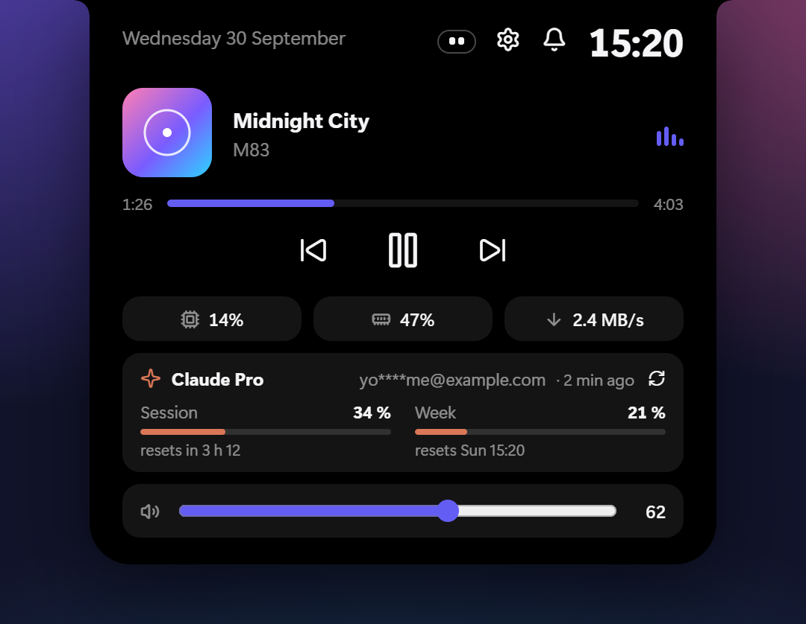
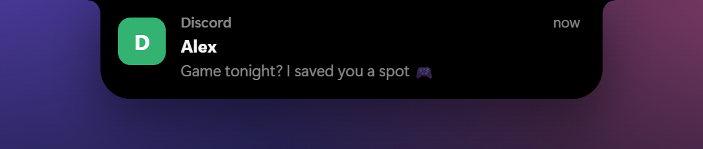
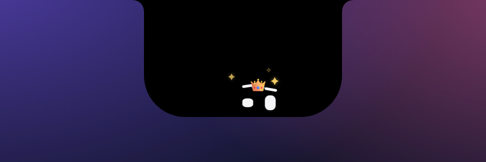
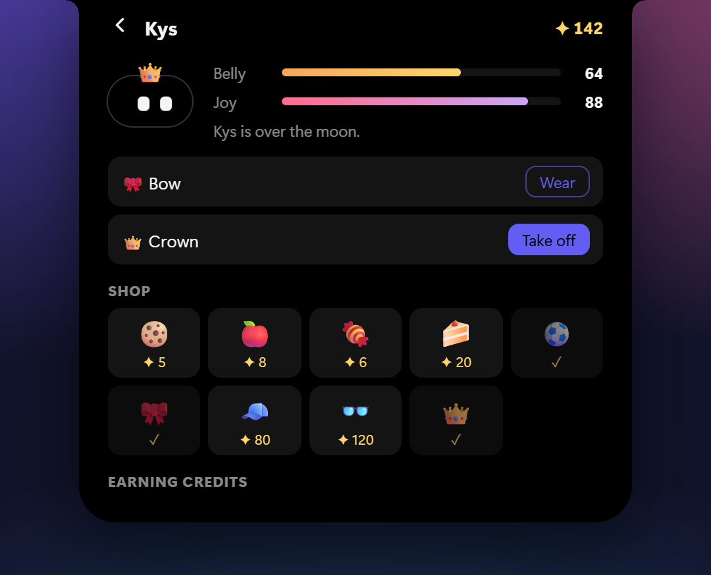
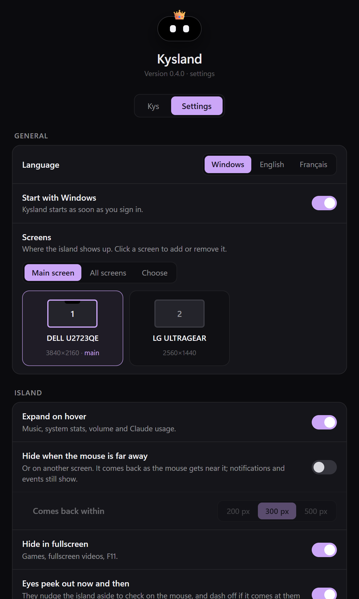
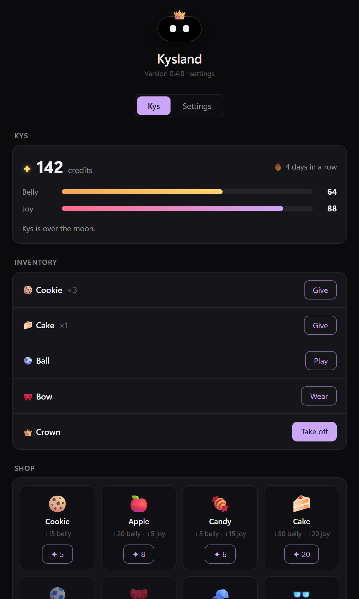

<div align="center">


# Kysland

**A Dynamic Island for Windows.**<br>
The time and what's playing at the top of your screen, your notifications, your system at a glance…<br>
and **Kys**, a little pair of eyes that lives in it.

[](https://github.com/KinjerJS/Kysland/releases/latest)


[](#license)

</div>

## Hover it



The island is a black notch attached to the top edge of the screen. Point at it and it stretches into a card, its elements gliding into place:

- **Music** from Spotify, your browser or any player: album art, a clickable progress bar, previous / play-pause / next, all tinted with the album's colors.
- **Your system**: CPU, RAM and network throughput.
- **Volume** with a slider, the mouse wheel or your keys. The island replaces the Windows volume flyout and follows whichever output is active (speakers, a Bluetooth headset…).
- **Claude usage** (optional): the 5-hour session and weekly limits of your Claude plan, with a warning at 80%.
- **A calendar** when you click the date.

It also stretches for a moment on its own: a volume change, a new track, the charger plugged in, the Wi-Fi coming back.

<br clear="right">

## Your notifications, in the island



Windows notifications drop into the island as they arrive. Click one to open its app, hover it to keep it on screen. The bell of the expanded island keeps the last 30, and deleting them there also clears them from the Windows notification center.

## Meet Kys

The eyes have a name: **Kys**. It lives in the island, and it has a life of its own.

<table>
<tr>
<td width="50%"></td>
<td width="50%"></td>
</tr>
<tr>
<td>Now and then it <b>drops in from the top</b>, knocking the time and the date askew, to check on your cursor. Rush at it and it flees.</td>
<td>Stay close and the island grows: it <b>explores</b>, comes next to your cursor, dozes off (Zzz)… circle around it and it gets <b>dizzy</b>.</td>
</tr>
</table>



**Look after it.** Kys gets hungry and a bit bored while you use your PC (never while it's off), and shows it: it asks for food, and looks down when it's miserable.

**Earn credits ✦** by playing with it:
- **catch** it while it peeks (come slowly, click its eyes);
- make it **dizzy**, poke it, let it come back from a **flight**;
- spend **time** together, and come back **every day** for a growing bonus.

**Spend them** in its shop: cookies, apples, candy and cake it munches right in the island, a ball to play with, and a bow, a cap, glasses or a crown to wear.

Everything is on its page: click the little Kys next to the gear in the expanded island.

<br clear="right">

## It knows when to step aside


- **Aiming at something behind it?** Approach slowly and the island tucks itself into the screen edge to let you click through, two little eyes watching you. Come in fast and it opens as usual.
- **Fullscreen**: it disappears during games, videos and F11.
- **Auto-hide** (optional): it slides away while your mouse is far from it or on another screen.
- **Dark backgrounds**: a thin outline keeps the black island visible.

<br clear="right">

## Make it yours

<table>
<tr>
<td width="50%"></td>
<td width="50%"></td>
</tr>
</table>

A settings window gathers every option: language (English or French, following Windows by default), start with Windows, **which screens** show the island, how it hides, Kys, notifications, volume keys… It opens from the right-click menu, the gear of the expanded island or the tray icon.

For more, `config.jsonc` and `style.css` are hot-reloaded: formats, colors, sizes, and even a full **Waybar-style status bar** with workspaces for [GlazeWM](https://github.com/glzr-io/glazewm).

## Install

**[Download the latest installer](https://github.com/KinjerJS/Kysland/releases/latest)** (`Kysland_x.y.z_x64-setup.exe`) and run it.

- It installs for your user account, no admin rights needed, and starts with Windows right after you sign in (turn that off in the settings).
- What changed in each version: [CHANGELOG.md](CHANGELOG.md).
- To uninstall: Settings → Apps. Kysland quits cleanly first, so the Windows volume flyout comes back. Your configuration in `~\.config\kysland` is kept.

Kysland isn't signed yet, so Windows SmartScreen or Defender may warn about it on download.

## Usage

Right-click the island, press **`Ctrl+Alt+W`** anywhere, or right-click the tray icon to open the menu: settings, Kys, reload, edit the configuration, language, screen, a **Dynamic Island** submenu (hiding from a slow cursor, eyes, fullscreen hiding, outline, Claude usage…), start with Windows, and the **CSS inspector** (DevTools).

| Command line | Effect |
|---|---|
| `--settings` / `--kys` | Open the settings window (on the Kys tab) |
| `--island="text" --icon=name` | Show a message in the island, e.g. `--island="Build finished" --icon=check-circle` |
| `--autostart=on` / `--autostart=off` | Start with Windows or not |
| `--quit` | Quit cleanly |
| `--repair` | Restore the volume flyout, the taskbar and the screen space, then exit |

## Configuration

Files live in `%USERPROFILE%\.config\kysland\`:

| File | Purpose |
|---|---|
| `config.jsonc` | Layout, modules, formats, mouse actions (documented with comments) |
| `style.css` | The look (CSS variables such as `--accent`, `--notch-bg`…) |
| `kys.json` | Kys's state: credits, gauges, inventory (managed by Kysland) |

Island options (in the `"island"` section):

| Option | Default | Description |
|---|---|---|
| `time-format` / `date-format` / `date-long-format` | `HH:mm` / `ddd D MMM` / `dddd D MMMM` | Any [dayjs format](https://day.js.org/docs/en/display/format) |
| `expand-on-hover` | `true` | Expand when hovered |
| `hover-delay` / `collapse-delay` | `120` / `350` | Milliseconds before expanding / collapsing |
| `media-linger` | `15` | Seconds a paused track stays displayed |
| `outline` | `"auto"` | Thin outline when it's mostly black around the island; `true` / `false` to force it (color: `--notch-outline-color`) |
| `dodge` / `dodge-speed` | `true` / `450` | Hide when the cursor approaches slower than this many px/s |
| `dodge-eyes` | `true` | Eyes watching the cursor while hidden |
| `dodge-roam` / `dodge-roam-delay` | `true` / `20` | Cursor still close after this many seconds: the island grows and the eyes roam |
| `peek` | `true` | Kys peeking into the resting island now and then |
| `auto-hide` / `auto-hide-distance` | `false` / `300` | Hide while the mouse is farther than this many px or on another screen |
| `hide-windows-osd` | `true` | Handle the volume keys and hide the Windows volume flyout |
| `volume-step` | `2` | Percent per volume key press |
| `notifications` | `true` | Show Windows notifications in the island |
| `notification-duration` | `6` | Seconds per notification |
| `claude` | `false` | Show Claude plan usage |
| `kemhome` | `http://localhost:8080` | KemHome agent URL (album art for Chrome), `false` to disable |
| `transients` | all `true` | Which events stretch the island: `volume`, `media`, `battery`, `network`, `workspace` |

Top-level options include `language` (`"auto"`, `"en"`, `"fr"`), `monitors` (`"primary"`, `"all"` or screen numbers from left to right starting at 0, e.g. `[0, 2]`), `reserve`, `hide-on-fullscreen` and `wallpaper`. Status bar modules (`workspaces`, `window`, `clock`, `cpu`, `memory`, `disk`, `network`, `audio`, `battery`, `launcher`, `power`, `media`, `custom/<name>`…) are listed in the comments of `config.jsonc`.

## Privacy

Everything stays on your PC, with two optional exceptions:

- **Claude usage**: Kysland reads the Claude Code sign-in token and sends it only to `api.anthropic.com` to fetch your usage. It never refreshes the token itself, so it can't sign Claude Code out. The usage endpoint is the one behind Claude Code's `/usage` command. It isn't a documented public API and may change.
- **Weather**: the sample `custom/weather` module queries wttr.in.

Notifications are read locally from the Windows notification database.

## Development

Kysland is built with [Tauri](https://tauri.app): the interface is HTML/CSS/JS, and the engine is Rust, calling Windows APIs directly (Core Audio, media controls, notifications, window management).

Requirements: Node.js, Rust (stable, MSVC) and the Visual Studio C++ build tools.

```sh
npm install
npm run dev          # run Kysland with hot rebuild of the Rust engine
npm run check        # checks: script syntax, invisible control characters, changelog
npm run build        # build the NSIS installer into src-tauri/target/release/bundle/nsis/
npm run screenshots  # regenerate the README images (headless Chrome, sample data)
```

Layout:

- `ui/`: the interface, served by the WebView. `index.html` / `island.js` / `notch.css` are the island, `settings.*` the settings window, `api.js` the bridge to the engine, `i18n.js` the displayed strings.
- `src-tauri/src/`: the engine. `lib.rs` (windows, menu, commands, background loop), `kys.rs` (Kys), `audio.rs`, `media.rs`, `notifs.rs`, `system.rs`, `glaze.rs`, `win32.rs`, `config.rs`, `autostart.rs`, `i18n.rs` (menu strings).
- `defaults/`: default configuration, bundled as a resource.
- `docs/screenshots/`: the pages behind the README images: the real interface with sample data.
- Code, comments and commits are in English; only displayed text is translated (`ui/i18n.js`, `src-tauri/src/i18n.rs`).

## Releasing

The GitHub Actions workflow runs the checks and builds the installer on every push and pull request. Pushing a version tag also publishes a GitHub Release with the installer attached, and that version's section of [CHANGELOG.md](CHANGELOG.md) as its text:

1. Bump the version in `package.json`, `src-tauri/tauri.conf.json` and `src-tauri/Cargo.toml`.
2. Add a `## x.y.z — date` section to `CHANGELOG.md` saying what changed (`npm run check` and the release build both refuse a version without one).
3. Tag and push:

```sh
git tag v0.4.0
git push origin main v0.4.0
```

## License

MIT
